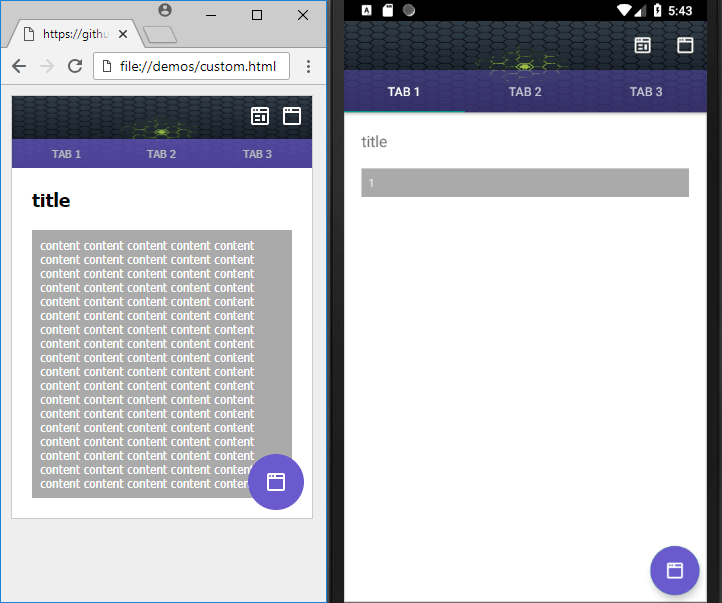
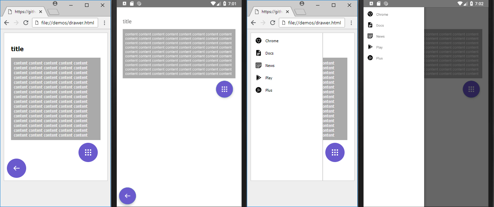
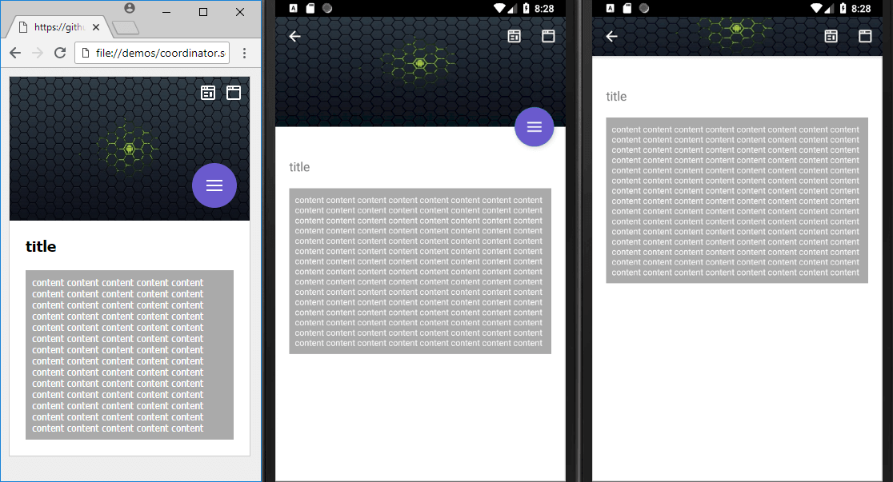
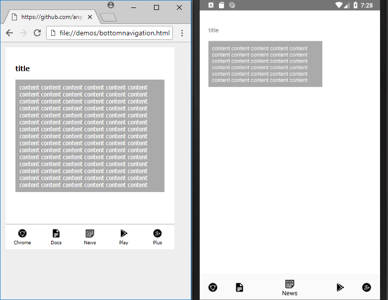
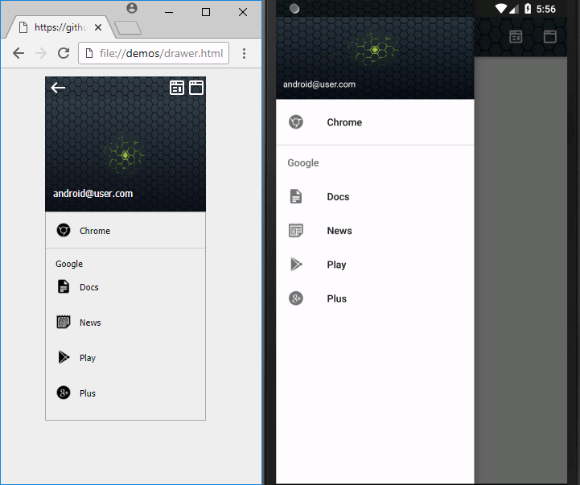
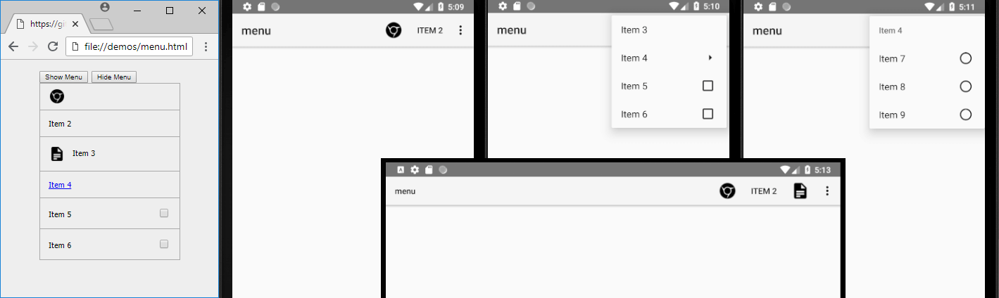

# squared

This program can convert moderately complex HTML pages into the standard XML layouts for Android. HTML is the most popular and versatile way to design user interfaces and can be used to generate the UI for any platform. SVG is nearly fully supported including transformations and CSS/SMIL animations.

The ratio is about 1 line of HTML for every 10 lines of Android XML when using squared to generate the UI for your mobile application. It will also auto-generate the XML resources for the entire project. Using HTML best practices and techniques will output the fastest possible layout structure which is close to 95% efficient and better than most hand-written code.

There is also a virtual DOM framework for the browser which offers fast querying and a better programming interface than a plain DOM element.

## Installation (global js variable: squared)

Express server through Node.js is available with a provided default configuration. It is sufficient to load this program locally and can also be used for development. Using Express is highly recommended as you can create a ZIP archive of the generated resources from inside your browser which can be conveniently extracted into your project folder. Installing these dependencies are only required if you plan on using Express as your local web server. 

* Install Node.js: http://www.nodejs.org
* Install squared: (choose one)

NPM  
&nbsp;&nbsp;&nbsp;&gt; npm install squared  
&nbsp;&nbsp;&nbsp;&gt; cd node_modules/squared  
&nbsp;&nbsp;&nbsp;&gt; node app.js  

GitHub  
&nbsp;&nbsp;&nbsp;&gt; git clone https://github.com/anpham6/squared  
&nbsp;&nbsp;&nbsp;&gt; cd squared  
&nbsp;&nbsp;&nbsp;&gt; npm install  
&nbsp;&nbsp;&nbsp;&gt; npm run prod -OR- npm run dev
&nbsp;&nbsp;&nbsp;&gt; node app.js  

* Open Browser: http://localhost:3000

*** OR ***

* Install squared-apache: https://github.com/anpham6/squared-apache
* Open Browser: http://localhost:8080

```javascript
<script src="/dist/squared.min.js"></script>
<script src="/dist/squared.base.min.js"></script>
<script src="/dist/squared.svg.min.js"></script> /* optional */
<script src="/dist/android.framework.min.js"></script> /* OR: chrome.framework.min.js */
<script>
    // optional
    squared.settings.targetAPI = 29;

    // without Express: use either console.log() or element.innerHTML to display using "system.write" commands

    document.addEventListener('DOMContentLoaded', function() {
        // Required
        squared.setFramework(android); // OR: 'chrome'

        // Required: zero or more DOM elements
        squared.parseDocument(/* document.getElementById('mainview') */, /* 'subview' */, /* etc... */); // OR: parseDocumentAsync
        squared.close();

        // Optional: node-express / squared-apache
        squared.saveToArchive(/* optional: archive name */, /* options */);
        // OR
        squared.copyToDisk(/* required: local directory */, /* options */);
        // OR
        squared.appendToArchive(/* required: location uri */, /* options */);

        // optional: start new "parseDocument" session
        squared.reset();
    });
</script>
```
The primary function "parseDocument" can be called on multiple elements and multiple times per session. The application will continuously and progressively build into a single entity with combined shared resources.

Library files are in the /dist folder. A minimum of *two* files are required to run squared.

1. squared
2. squared-base
3. squared-svg - *optional*
4. framework (e.g. android | chrome)
5. extensions (e.g. android.widget) - *optional*

Usable combinations: 1-2-4 + 1-2-4-5 + 1-2-3-4-5 + 1-3

There are ES6 minified versions (*.min.js) and also ES6 non-minified versions. Browsers which do not support at least ES6 (under 5%) are not being supported due to this primarily being a development tool.

NOTE: Calling "save" or "write" methods before the images have completely loaded can sometimes cause them to be excluded from the generated layout. In these cases you should use the "parseDocument" promise method "then" to set a callback for your commands.

```javascript
<script>
    document.addEventListener('DOMContentLoaded', function() {
        squared.setFramework(android);
        squared.parseDocument(/* 'mainview' */, /* 'subview' */).then(function() {
            squared.close();
            squared.saveToArchive();
        });
    });
</script>
```

*** External CSS files cannot be parsed when loading HTML pages using the file:// protocol (hard drive) with Chrome 64 or higher. Loading the HTML page from a web server (http://localhost) or embedding the CSS files into a &lt;style&gt; tag can get you past this security restriction. You can also use your preferred browser Safari/Edge/Firefox. The latest version of Chrome is ideally what you should use to generate the production version of your program. ***

### ALL: User Settings

These settings are available in the global variable "squared" to customize your desired output structure. Each framework shares a common set of settings and also a subset of their own settings.

#### Example: android

```javascript
squared.settings = {
    builtInExtensions: [ // default is all
        'android.delegate.background',
        'android.delegate.negative-x',
        'android.delegate.positive-x',
        'android.delegate.max-width-height',
        'android.delegate.percent',
        'android.delegate.css-grid',
        'android.delegate.scrollbar',
        'android.delegate.radiogroup',
        'squared.accessibility',
        'squared.relative',
        'squared.css-grid',
        'squared.flexbox',
        'squared.table',
        'squared.column',
        'squared.list',
        'squared.verticalalign',
        'squared.grid',
        'squared.sprite',
        'squared.whitespace',
        'android.resource.svg',
        'android.resource.background',
        'android.resource.strings',
        'android.resource.fonts',
        'android.resource.dimens',
        'android.resource.styles',
        'android.resource.data',
        'android.resource.includes'
    ],
    targetAPI: 29,
    resolutionDPI: 160, // Pixel C: 320dpi 2560x1800
    resolutionScreenWidth: 1280,
    resolutionScreenHeight: 900,
    framesPerSecond: 60,
    supportRTL: true,
    preloadImages: true,
    compressImages: false, // png | jpeg - TinyPNG API Key <https://tinypng.com/developers>
    convertImages: '', // png | jpeg | bmp | squared-apache: gif | tiff
    supportNegativeLeftTop: true,
    exclusionsDisabled: false,
    customizationsOverwritePrivilege: true,
    showAttributes: true,
    createQuerySelectorMap: false,
    convertPixels: 'dp',
    insertSpaces: 4,
    autoCloseOnWrite: true,
    showErrorMessages: true,
    manifestLabelAppName: 'android',
    manifestThemeName: 'AppTheme',
    manifestParentThemeName: 'Theme.AppCompat.Light.NoActionBar',
    outputMainFileName: 'activity_main.xml',
    outputDirectory: 'app/src/main',
    outputEmptyCopyDirectory: false,
    outputArchiveName: 'android-xml',
    outputArchiveFormat: 'zip', // zip | tar | gz/tgz | squared-apache: 7z | jar | cpio | xz | bz2 | lzma | lz4 | zstd
};
```
#### Example: chrome

```javascript
squared.settings = {
    builtInExtensions: [ // default is none
        'chrome.compress.png',
        'chrome.compress.jpeg',
        'chrome.compress.brotli',
        'chrome.compress.gzip',
        'chrome.convert.png',
        'chrome.convert.jpeg',
        'chrome.convert.bmp',
        'chrome.convert.gif', // squared-apache: gif | tiff
        'chrome.convert.tiff'
    ],
    preloadImages: false,
    compressImages: false, // png | jpeg - TinyPNG API Key <https://tinypng.com/developers>
    showErrorMessages: false,
    createQuerySelectorMap: true,
    excludePlainText: true,
    outputFileExclusions: ['squared.*', 'chrome.framework.*'],
    outputEmptyCopyDirectory: false,
    outputArchiveName: 'chrome-data',
    outputArchiveFormat: 'zip', // zip | tar | gz/tgz | squared-apache: 7z | jar | cpio | xz | bz2 | lzma | lz4 | zstd
};
```

### ALL: Public Properties and Methods

There is no official documentation as this project is still in early development. The entire source code is available on GitHub if you need further clarification.

```javascript
.settings // see user preferences section

setFramework(module: {}, cached?: boolean) // install application converter
setViewModel(data?: {}) // object data for layout bindings

parseDocument() // see installation section
parseDocumentAsync()

ready() // boolean indicating if parseDocument can be called
close() // close current session preceding write to disk or local output
reset() // clear cached layouts and reopen new session

// Required: node-express / squared-apache
// NOTE: options: { assets?: RequestAsset[], exclusions?: {}, callback?: () => void }

saveToArchive(filename?: string, options?: {}) // save entire project as a new archive
createFrom(format: string, options: {}) // create new archive from only RequestAsset[]

// Required (local archives): --disk-read | --unc-read | --access-all (command-line)
appendToArchive(pathname: string, options?: {}) // append entire project to a copy of a preexisting archive
appendFromArchive(pathname: string, options: {}) // create new archive from a preexisting archive and from only RequestAsset[]

// Required (all): --disk-write | --unc-write | --access-all (command-line)
copyToDisk(directory: string, options?: {}) // copy entire project to local directory

toString() // main layout file contents

include(extension: string | squared.base.Extension, options?: {}) // see extension configuration section
retrieve(name: string) // retrieve an extension by namespace or control
configure(name: string, options: {}) // see extension configuration section
exclude(name: string) // remove an extension by namespace or control
```

### ANDROID: Public System Methods

You can use the "system.customize" method to change the default settings for the specific controls which are applied when a view is rendered.

```javascript
squared.system.customize(build: number, widget: string, options: {}) // global attributes applied to specific views
squared.system.addXmlNs(name: string, uri: string) // add global namespaces for third-party controls

// NOTE: options: { assets?: RequestAsset[], callback?: () => void }

squared.system.copyLayoutAllXml(directory: string, options?: {}) // copy generated xml
squared.system.copyResourceAllXml(directory: string, options?: {})
squared.system.copyResourceAnimXml(directory: string, options?: {})
squared.system.copyResourceArrayXml(directory: string, options?: {})
squared.system.copyResourceColorXml(directory: string, options?: {})
squared.system.copyResourceDimenXml(directory: string, options?: {})
squared.system.copyResourceDrawableXml(directory: string, options?: {})
squared.system.copyResourceFontXml(directory: string, options?: {})
squared.system.copyResourceStringXml(directory: string, options?: {})
squared.system.copyResourceStyleXml(directory: string, options?: {})

squared.system.saveLayoutAllXml(filename?: string, options?: {}) // save generated xml
squared.system.saveResourceAllXml(filename?: string, options?: {})
squared.system.saveResourceAnimXml(filename?: string, options?: {})
squared.system.saveResourceArrayXml(filename?: string, options?: {})
squared.system.saveResourceColorXml(filename?: string, options?: {})
squared.system.saveResourceDimenXml(filename?: string, options?: {})
squared.system.saveResourceDrawableXml(filename?: string, options?: {})
squared.system.saveResourceFontXml(filename?: string, options?: {})
squared.system.saveResourceStringXml(filename?: string, options?: {})
squared.system.saveResourceStyleXml(filename?: string, options?: {})

squared.system.writeLayoutAllXml() // write generated xml
squared.system.writeResourceAllXml()
squared.system.writeResourceAnimXml()
squared.system.writeResourceArrayXml()
squared.system.writeResourceColorXml()
squared.system.writeResourceDimenXml()
squared.system.writeResourceDrawableXml()
squared.system.writeResourceFontXml()
squared.system.writeResourceStringXml()
squared.system.writeResourceStyleXml()

squared.system.copyResourceDrawableImage(directory: string, options?: {})
squared.system.saveResourceDrawableImage(filename?: string, options?: {})
squared.system.writeResourceDrawableImage()

squared.system.copyResourceRawVideo(directory: string, options?: {})
squared.system.saveResourceRawVideo(filename?: string, options?: {})
squared.system.writeResourceRawVideo()

squared.system.copyResourceRawAudio(directory: string, options?: {})
squared.system.saveResourceRawAudio(filename?: string, options?: {})
squared.system.writeResourceRawAudio()
```

```javascript
<script>
    // targetAPI: 0 - ALL, 29 - Android Q
    squared.system.customize(squared.settings.targetAPI, 'Button', {
        android: {
            minWidth: '35px',
            minHeight: '25px'
        }
    });

    // NOTE: "exclusions" attribute and some compression formats are only available when using squared-apache
    squared.settings.outputArchiveFormat = '7z';
    squared.saveToArchive('archive1', {
        assets: [
            {
                pathname: 'app/src/main/res/drawable',
                filename: 'ic_launcher_background.xml',
                uri: 'http://localhost:3000/examples/common/ic_launcher_background.xml',
                compress: [{ format: 'gz', level: 9 }, { format: 'br' }, { format: 'bz2' }, { format: 'lzma' }, { format: 'zstd' }, { format: 'lz4' }]
            }
        ],
        exclusions: { // All attributes are optional
            pathname: ['app/build', 'app/libs'],
            filename: ['ic_launcher_foreground.xml'],
            extension: ['iml', 'pro'],
            pattern: ['outputs', 'grad.+\\.', '\\.git']
        }
    });
</script>
```

### CHROME: Public System Methods

The system methods querySelector and querySelectorAll can also be called from every Node object and provide the same functionality as the similarly named DOM methods.

```javascript
squared.system.getElementById(value: string, cache?: boolean) // cache: default "true"
squared.system.querySelector(value: string, cache?: boolean)
squared.system.querySelectorAll(value: string, cache?: boolean)
squared.system.getElement(element: HTMLElement, cache?: boolean) // cache: default "false"
squared.system.getElementMap()
squared.system.clearElementMap()

// NOTE: options: { assets?: RequestAsset[], callback?: () => void }

squared.system.copyHtmlPage(directory: string, options?: {}) // option "name": e.g. "index.html"
squared.system.copyScriptAssets(directory: string, options?: {})
squared.system.copyLinkAssets(directory: string, options?: {}) // option "rel": e.g. "stylesheet"
squared.system.copyImageAssets(directory: string, options?: {})
squared.system.copyVideoAssets(directory: string, options?: {})
squared.system.copyAudioAssets(directory: string, options?: {})
squared.system.copyFontAssets(directory: string, options?: {})

squared.system.saveHtmlPage(filename?: string, options?: {}) // option "name": e.g. "index.html"
squared.system.saveScriptAssets(filename?: string, options?: {})
squared.system.saveLinkAssets(filename?: string, options?: {}) // option "rel": e.g. "stylesheet"
squared.system.saveImageAssets(filename?: string, options?: {})
squared.system.saveVideoAssets(filename?: string, options?: {})
squared.system.saveAudioAssets(filename?: string, options?: {})
squared.system.saveFontAssets(filename?: string, options?: {})

squared.system.saveAsWebPage(filename?: string, options?: {})

// async methods
await chrome.getElement(element: HTMLElement, cache?: boolean) // cache: default "true"
await chrome.getElementById(value: string, cache?: boolean)
await chrome.querySelector(value: string, cache?: boolean)
await chrome.querySelectorAll(value: string, cache?: boolean)
```

### ALL: Excluding Procedures / Applied Attributes

Most attributes can be excluded from the generated XML using the dataset feature in HTML. One or more can be applied to any tag using the OR "|" operator. These may cause warnings when you compile your project and should only be used in cases when an extension has their custom attributes overwritten.

```xml
<div data-exclude-section="DOM_TRAVERSE | EXTENSION | RENDER | ALL"
     data-exclude-procedure="LAYOUT | ALIGNMENT | OPTIMIZATION | CUSTOMIZATION | ACCESSIBILITY | LOCALIZATION | ALL"
     data-exclude-resource="BOX_STYLE | BOX_SPACING | FONT_STYLE | VALUE_STRING | IMAGE_SOURCE | ASSET | ALL">
</div>
<div>
    <span data-exclude-resource="FONT_STYLE">content</span>
    <input id="cb1" type="checkbox" data-exclude-procedure="ACCESSIBILITY"><label for="cb1">checkbox text</label>
</div>
```

### ALL: Extension Configuration (example: android)

Layout rendering can also be customized using extensions as the program was built to be nearly completely modular. Some of the common layouts already have built-in extensions which you can load or unload based on your preference.

CSS Grid and Flexbox layouts are are for the most part fully supported. There is also support for SVG and most of the common floating techniques.

```javascript
<script src="/dist/extensions/android.widget.coordinator.min.js"></script>
<script src="/dist/extensions/android.widget.menu.min.js"></script>
<script src="/dist/extensions/android.widget.toolbar.min.js"></script>
<script>
    // configure an extension
    squared.configure('android.widget.toolbar', { // optional: default configuration is usually provided
        'elementId': { // HTML DOM
            appBar: {
                android: {
                    theme: '@style/ThemeOverlay.AppCompat.Dark.ActionBar'
                }
            }
        }
    });

    // third-party: create an extension
    class Sample extends squared.base.Extension {
        constructor(name, framework = 0, options = {}) {
            // framework: universal = 0; android = 2; chrome = 4;
            super(name, framework, options);
        }
    }

    // third-party: install an extension
    var sample = new Sample('your.namespace.sample', 0, { /* same as configure */ });
    squared.include(sample);
</script>
```

### ALL: Layouts and binding expressions (example: android)

ViewModel data can be applied to most HTML elements using the dataset attribute.

```javascript
<script>
    squared.setViewModel({
        import: ['java.util.Map', 'java.util.List'],
        variable: [
            { name: 'user', type: 'com.example.User' },
            { name: 'list', type: 'List&lt;String>' },
            { name: 'map', type: 'Map&lt;String, String>' },
            { name: 'index', type: 'int' },
            { name: 'key', type: 'String' }
        ]
    });
</script>
```

Two additional output parameters are required with the "data-viewmodel" prefix. 

data-viewmodel-{namespace}-{attribute} -> data-viewmodel-android-text

```xml
<div>
    <label>Name:</label>
    <input type="text" data-viewmodel-android-text="user.firstName" />
    <input type="text" data-viewmodel-android-text="user.lastName" />
</div>
```

```xml
<layout>
    <data>
        <import type="java.util.Map" />
        <import type="java.util.List" />
        <variable name="user" type="com.example.User" />
        <variable name="list" type="List<String>" />
        <variable name="map" type="Map<String, String>" />
        <variable name="index" type="int" />
        <variable name="key" type="String" />
    </data>
    <LinearLayout>
        <TextView
            android:text="Name:" />
        <EditText
            android:inputType="text"
            android:text="@{user.firstName}" />
        <EditText
            android:inputType="text"
            android:text="@{user.lastName}" />
    </LinearLayout>
</layout>
```

### ALL: Custom Attributes (example: android)

System or extension generated attributes can be overridden with dataset. They will only be visible on the declared framework.

data-{framework}-attr-{namespace}? -> default: "android"

```xml
<div
    data-android-attr="layout_width::match_parent;layout_height::match_parent"
    data-android-attr-app="layout_scrollFlags::scroll|exitUntilCollapsed">
</div>
```

```xml
<LinearLayout
    android:layout_width="match_parent"
    android:layout_height="match_parent"
    app:layout_scrollFlags="scroll|exitUntilCollapsed" />
```

### ALL: Redirecting Output Location

It is sometimes necessary to append elements into other containers when trying to design a UI which will look identical on the Android device. Redirection will fail if the target "location" is not a block/container element.

```xml
<div>
    <span>Item 1</span>
    <span data-target="location">Item 2</span>
    <span data-target="location" data-target-index="1">Item 3</span>
<div>
<ul id="location">
    <li>Item 4</li>
    <li>Item 5</li>
    <!-- span -->
</ul>
```

```xml
<LinearLayout>
    <TextView>Item 1</TextView>
</LinearLayout>
<LinearLayout>
    <TextView>Item 4</TextView>
    <TextView>Item 3</TextView>
    <TextView>Item 5</TextView>
    <TextView>Item 2</TextView>
</LinearLayout>
```

Using "target" into a ConstraintLayout or RelativeLayout container will not include automatic positioning.

### ANDROID: Layout Includes / Merge Tag

Some applications can benefit from using includes or merge tags to share common templates. Merge is the default behavior and can be disabled using the "false" attribute value. Nested includes are also supported.

```xml
<div>
    <div>Item 1</div>
    <div data-android-include="filename1" data-android-include-merge="false">Item 2</div>
    <div>Item 3</div>
    <div data-android-include-end="true">Item 4</div>
    <div data-android-include="filename2" data-android-include-end="true">Item 5</div>
</div>
```

```xml
<LinearLayout>
    <TextView>Item 1</TextView>
    <include layout="@layout/filename1" />
    <include layout="@layout/filename2" />
</LinearLayout>
<!-- res/layout/activity_main.xml -->

<merge>
    <TextView>Item 2</TextView>
    <TextView>Item 3</TextView>
    <TextView>Item 4</TextView>
</merge>
<!-- res/layout/filename1.xml -->

<TextView>Item 5</TextView>
<!-- res/layout/filename2.xml -->
```

The attributes "android-include" and "android-include-end" can only be applied to elements which share the same parent container. See /demos/gradient.html for usage instructions.

### ANDROID: SVG animations with CSS/SMIL

Only the XML based layout and resource files are generated with squared which can be viewed on the Android device/emulator without any Java/Kotlin backend code. To play animations you also have to "start" the animation in MainActivity.java.

```javascript
    import android.graphics.drawable.Animatable;

    android.widget.ImageView imageView1 = findViewById(R.id.imageview_1);
    if (imageView1 != null) {
        Animatable animatable = (Animatable) imageView1.getDrawable();
        animatable.start();
    }
```

### ANDROID: Extension Widgets

Most of the Android support library extensions can be configured using the same attribute name in the Android documentation. See /android/widget/*.html for usage instructions in the squared-apache <https://github.com/anpham6/squared-apache> project.

- android.external
- android.substitute

- android.constraint.guideline

- android.widget.coordinator
- android.widget.floatingactionbutton
- android.widget.menu
- android.widget.bottomnavigation
- android.widget.toolbar
- android.widget.drawer













### ALL: Jimp (node-express) / ImageJ (squared-apache)

Image conversion can be achieved using the mimeType property in a RequestAsset object. The supported formats are:

* png
* jpeg
* bmp
* gif (node-express: readonly)
* tiff (node-express: readonly)

```xml
{saveAsExtension}:image/{format}
```

```javascript
const options = {
    assets: [
        {
            pathname: 'images',
            filename: 'pencil.png',
            mimeType: 'jpeg:image/png',
            uri: 'http://localhost:3000/demos/images/pencil.png'
        },
        {
            pathname: 'images',
            filename: 'pencil.png',
            mimeType: 'bmp:image/png',
            uri: 'http://localhost:3000/demos/images/pencil.png'
        }
    ]
};
```
Placing an @ symbol (@png:image/jpeg) before the mime type will remove the original file from the package. The % symbol (%png:image/jpeg) will choose the smaller of the two files.

### ALL: User Written HTML

Using excessive DIV tags are not required for mobile devices which can cause additional FrameLayouts or LinearLayouts to be generated. Block level elements are almost always rendered to preserve any CSS styles which are applied to the tag.

If you plan on using this library it adheres to strict HTML validation rules regarding "block-level" and "inline" elements. You can basically code the HTML any way you want although using reasonable techniques for mobile devices will lead you to a more accurate layout.